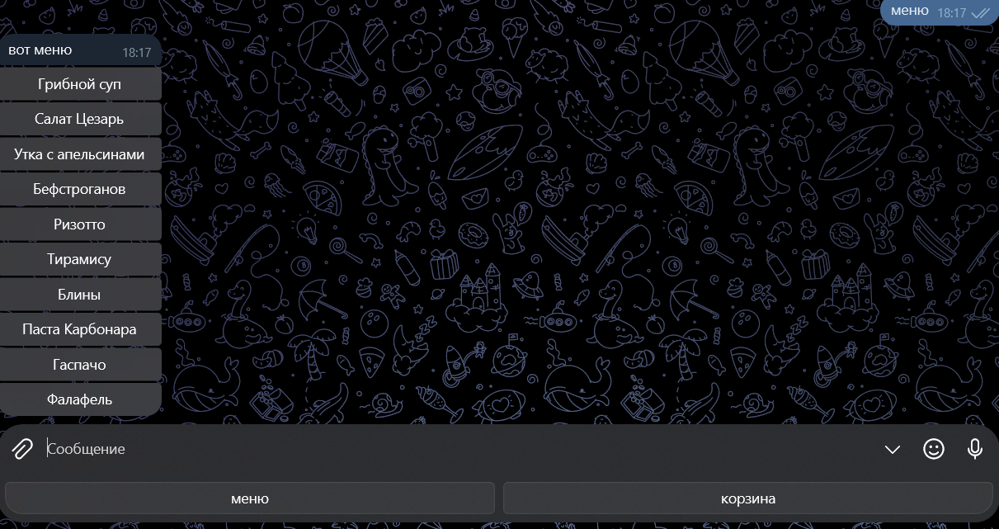
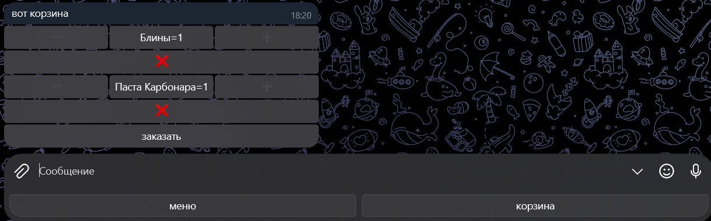
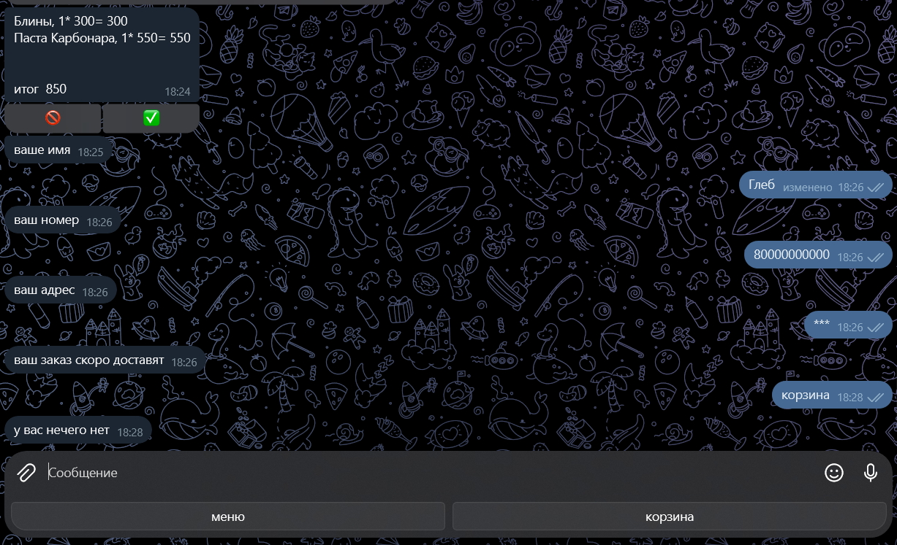

# Проект "Чат-бот для заказа еды"
## Описание проекта.
Учебный проект, чат-бот для заказа еды. 
## Возможности чат-бота.
- Выбор блюд из меню.
- Просмотр содержимого корзины.
- Добавление блюд в корзину.
- Оформление заказа выбранных товаров.
## Чему я научился?
- Создание структуры JSON-файла для хранения записей.
- Новый тип кнопок ReplyKeyboardMarkup для отправки шаблон
ных сообщений
- Универсальная функция для работы с корзиной: добавление и
 изменение блюд.
- Вывод блюд в меню с пагинацией.
- Оформление чека.
- Возможность указать телефон и адрес доставки.

В дополнение к перечисленному два домашних проекта: [бот для поддерж
ки пользователей](https://github.com/artemdres/bot_helper) и [бот для ведения здорового образа жизни](https://github.com/artemdres/zapisi_na_trenirovke_bot).
## Работа сайта.
### Меню

### Корзина

### Заказ

